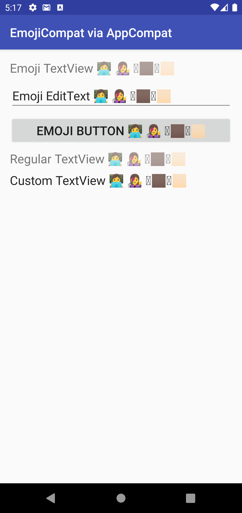
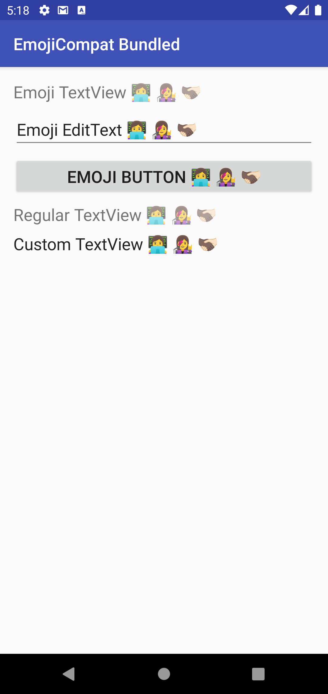
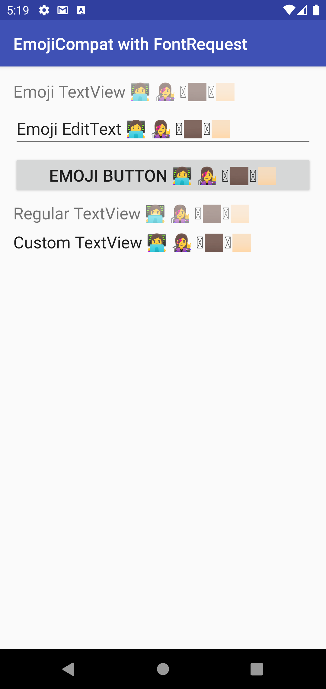

Android EmojiCompat Sample (Kotlin)
===================================

A quick demonstration of the various ways to
[Support Modern Emoji](https://developer.android.com/develop/ui/views/text-and-emoji/emoji2) using
Google's EmojiCompat library

Source initially copied from
[android/user-interface-samples/EmojiCompat](https://github.com/android/user-interface-samples/tree/main/EmojiCompat)

## Dependency Versions

| library   | version |
|-----------|---------|
| appcompat | 1.5.1   |
| emoji2    | 1.2.0   |

## Demo Apps

### app-emojicompat-appcompat

Using AppCompat [to support the latest emoji](https://developer.android.com/develop/ui/views/text-and-emoji/emoji2#appcompat).
AppCompat will invoke `EmojiCompatInitializer` at app startup.

### app-emojicompat-bundled

Bundling the _Noto Color Emoji Compat_ font by way of the `emoji2-bundled` artifact, as described
[here](https://developer.android.com/develop/ui/views/text-and-emoji/emoji2#support-bundled-fonts).
* Invoking `EmojiCompat.init(BundledEmojiCompatConfig(..))` during `Application.onCreate`.
* Manifest provider for `EmojiCompatInitializer` is still present. Removing this as described
[here](https://developer.android.com/develop/ui/views/text-and-emoji/emoji2#use-different-font-provider)
breaks the integration.

### app-emojicompat-fontrequest

Launching a Font Request to download the _Noto Color Emoji Compat_ font by initializing EmojiCompat
with `FontRequestEmojiCompatConfig`.
* Following the FontRequest flow as demonstrated in the
[Android EmojiCompat Sample project](https://github.com/android/user-interface-samples/tree/main/EmojiCompat)
* Removed the Manifest provider for `EmojiCompatInitializer` as described [here](https://developer.android.com/develop/ui/views/text-and-emoji/emoji2#use-different-font-provider)

## Test - Android 11 Emulator

EmojiCompat configurations that rely on FontRequest do not appear functional on an Android 11
Emulator with up-to-date Google Play Services. The steps to resolve this issue provided
[here](https://developer.android.com/develop/ui/views/text-and-emoji/emoji2#use-different-font-provider)
have not resolved the issue.

Test: Multi-skin-toned handshake emoji should render successfully: 🫱🏿‍🫲🏻

Result: Only renders when EmojiCompat is initialized with `BundledEmojiCompatConfig`

| AppCompat                                                                                 | Bundled | FontRequest |
|-------------------------------------------------------------------------------------------|---------|-------------| 
|  |  |  |